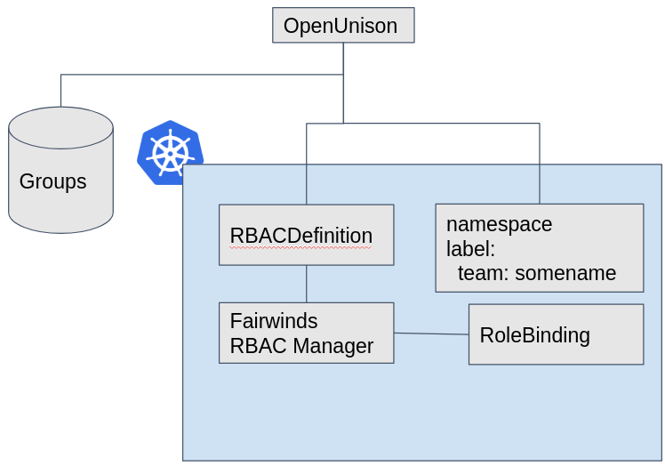
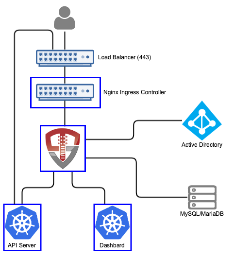
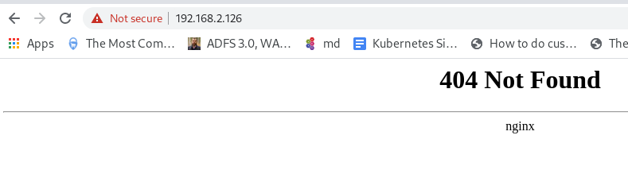

# I Can RBAC and So Can You - The Demo

This repo contains the code to be able to re-create the demo of team based authorization for Kubernetes using [OpenUnison](https://www.tremolosecurity.com/products/) and [Fairwinds' RBAC Manager](https://github.com/FairwindsOps/rbac-manager).  The goal of the demo was to combine multiple mechanisms for RBAC management to provide a self-service interface where a user can:

1. Register a team
2. Create `Namespace` objects owned by that team
3. Provide a self-service interface for users to request access to a team
4. SSO into Kubernetes and the dashboard with your Active Directory credentials

## Logical Architecture

This demo has three primary use cases:

*As a team owner, I can request a team be created.  Once approved I can create namespaces owned by that team* - In this use case a team owner can request a team, along with an approver, admin, and viewer group, be created.  Once approved, the owner of this team is repsonsible for creating `Namespace` objects. via OpenUnison.  Each `Namespace` that is created is tagged with the team's name, allowing Fairwinds' RBAC Manager to generate RBAC bindings for the `Namespace`.

*As a developer, I can request access to join a team and be granted to all `Namespace` objects that team owns* - Once teams are created, developers can request access to a team.  The team owner is responsible for approving access.  Once approved for one of the team roles, admin or viewier, the developer is able to access those `Namespace` objects without admin intervention.

*As a developer, I can securely authenticate to the cluster using wither `kubectl` or the Kubernetes dashboard* - Developers can securely use the same tools they would in any other environment, but using their enterprise credentials.



In addition to the above use cases meant to demonstrate the different ways to manage RBAC in a cluster, this demo provides the ability to delete namespaces, view audit reports, etc.

## Physical Arhitecture

Deploything the demo requires:

1. Kubernetes - Because it's a k8s conference
2. NGINX Ingress - For access to OpenUnison
3. SMTP Server - To notify users when approval requests need to be acted on
4. MariaDB Database - Stores user and group data, as well as audit data
5. Active Directory - To store user data and credentials
6. Fairwinds' RBAC Manager - This generates the `RoleBinding` objects in each `Namespace` 

This README assumes you have a Kubernetes cluster and walks you through deploying everything else.



## Deployment

### NGINX Ingress

First, [deploy the NGINX Ingress per the instructions](https://kubernetes.github.io/ingress-nginx/deploy/).  This will vary based on your deployment method.  Before you move past this step, make sure your browser can interact with default Ingress NGINX endpoint.  When you go to your load balancer's IP you should see something like this:



In this instance my load balancer is running on 192.168.2.126.

### SMTP Server

In order to notify approvers that they have an open access request and users that their access request has been approved you need an SMTP server.  For the demo, we used Tremolo Security's [Black Hole SMTP server](https://github.com/TremoloSecurity/smtp-blackhole) that just takes all incoming emails and throws them in the bit bucket.  If you want to deploy this demo in your own environment and have an SMTP server you can skip this step:

```
$ kubectl create ns blackhole
$ kubectl create deployment blackhole --image=tremolosecurity/smtp-blackhole -n blackhole
$ kubectl expose deployment/blackhole --type=ClusterIP --port 1025 --target-port=1025 -n blackhole
```

### MariaDB Database

The database provides several important roles:

1. Stores state data for workflows and the message bus
2. Stores user and group authorization data
3. Stores audit data for changes made to users and the cluster
4. Stores state data for the authentication process

If you don't have a database available, `src/main/yaml/mariadb_k8s.yaml` will deploy one for you.  It assumes you have a default storage class.  If you don't, [Rancher's local volume provisioner](https://github.com/rancher/local-path-provisioner) is a great way to go for development.

```
$ kubectl create -f src/main/yaml/mariadb_k8s.yaml
```

### Active Directory

Active Directory is the most common place for enterprises to store user identity and credentials.  For the demo we assumed you have one AD domain controller that has LDAPS enabled.  If you don't, thats OK!  You can use Tremolo Security's [ApacheDS container](https://hub.docker.com/repository/docker/tremolosecurity/apacheds) to simulate Active Directory!

First, create a keypair for apacheds to use TLS:

```
$ mkdir /tmp/apachds
$ cd /tmp/apacheds
$ keytool -genkeypair -storetype JKS -alias apacheds-tls -keyalg RSA -keysize 2048 -sigalg SHA256withRSA -keystore ./apacheds.jks -validity 3650
```

Use `start123` as the keystore password.  Use `apacheds` as your "first and last name", use `dev` for everything else.  When asked for the key password, just hit enter.  Next, create the namespace and keystore `Secret`, deployment and service:

```
$ kubectl create ns apacheds
$ kubectl create secret generic apacheds-ks -n apacheds --from-file=.
$ kubectl create -f /path/to/kubeconeu/src/main/yaml/apacheds-test-users.yaml
$ kubectl create -f /path/to/kubeconeu/src/main/yaml/apacheds-test-deployment.yaml
$ kubectl expose deployment apacheds-dev --port=10636 --target-port=10636 -n apacheds
```

### Fairwinds RBAC Manager

This one is easy:

```
$ kubectl create ns rbac-manager
$ helm install rbac-manager fairwinds-stable/rbac-manager --namespace rbac-manager
```

### Kubernetes Dashboard

Another easy one:

```
$ kubectl apply -f https://raw.githubusercontent.com/kubernetes/dashboard/v2.1.0/aio/deploy/recommended.yaml
```

Don't worry about setting up users or `Ingress` objects, Orchestra will do that for you.

### Builing the Orchestra Container

Orchestra is an application built on top of OpenUnison.  Think of OpenUnison as the underlying identity services and Orchestra is an application that pulls them together for Kubernetes.  In this instance, we had to customize the standard AD Orchestra portal.  In the not too distant future, you'll be able to do the customizations you need to Orchestra without building a new container, so stay tuned!

That said, to build you need OpenJDK 11 and Apache Maven.  Once installed, set three environment variables that tell maven where you want the resulting container to be pushed to (DO NOT DO THIS ON A METERED CONNECTION):

```
$ export OU_CONTAINER_DEST=docker.lab.tremolo.dev/lab/kubeconeu
$ export OU_REG_USER=notreadl
$ export OU_REG_PASSWORD=notreal
$ mvn clean package; mvn compile jib:build
```

The last step can take 5-10 minutes and will download a few hundred MB of libraries.  But once it's done you'll have a new container.  

### Deploying Orchestra

Almost there.  Install the OpenUnison helm charts and deploy the operator.

```
$ helm repo add tremolo https://nexus.tremolo.io/repository/helm/
$ helm repo update
$ kubectl create ns openunison
$ helm install openunison tremolo/openunison-operator --namespace openunison
$ kubectl create -f src/main/yaml/orchestra-secrets-source.yaml
```

Next, you'll need to get the certificate from the keystore we created earlier and base64 encode it:

```
$ keytool -export -keystore ./apacheds.ks -alias apacheds-tls -storepass start123 -rfc 2>/dev/null | base64 -w 0
```

Take the output and set it as the value for `trusted_certs[0].pem_b64` in `src/main/yaml/values-k8s-ad-kubeconeu.yaml`.  This will let OpenUnison communicate to our "AD" securely.  Finally, update `src/main/yaml/values-k8s-ad-kubeconeu.yaml` with new values for `network.openunison_host`,`network.dashboard_host`, and `network.api_server_host`.  These host names MUST all be different and all point to your load balancer.  Also update `image` to point to the image you created in building orchestra.

Now deploy the orchestra portal using your updates to `src/main/yaml/values-k8s-ad-kubeconeu.yaml`:

```
$ helm install orchestra tremolo/openunison-k8s-activedirectory --namespace openunison -f src/main/yaml/values-k8s-ad-kubeconeu.yaml
```

It may take a few minutes, but you should have three containers running in the `openunison` namespace:

```
NAME                                    READY   STATUS        RESTARTS   AGE
amq-orchestra-dcc5d8466-w7pvs           1/1     Running       0          4m36s
openunison-operator-7df75858dc-jskpk    1/1     Running       0          24m
openunison-orchestra-cc9c44949-fmcqc    1/1     Running       0          69s
```

Once the orchestra pod is running, create the custom URL and workflows to support our use cases:

```
$ helm install cluster-management tremolo/openunison-k8s-cluster-management -n openunison
$ kubectl apply -f src/main/yaml/objects/urls
$ kubectl apply -f src/main/yaml/objects/workflows
```

You have to wait for orchestra to be running because there are validating webhooks that will fail if orchestra isn't running.  Lastly, login using the username `mmosley` and the password `start123` by navigating your browser to the host you specified in `network.openunison_host`.  You need to now logout and run the following command to bootstrap yourself as an administrator:

```
$ kubectl exec -ti mariadb-0 -n mariadb -- /usr/bin/mysql -u root --password=start123 -e "insert into userGroups (userId,groupId) values (2,1);" unison
$ kubectl exec -ti mariadb-0 -n mariadb -- /usr/bin/mysql -u root --password=start123 -e "insert into userGroups (userId,groupId) values (2,2);" unison
```

Log back in as mmosley and you're where the demo starts!
